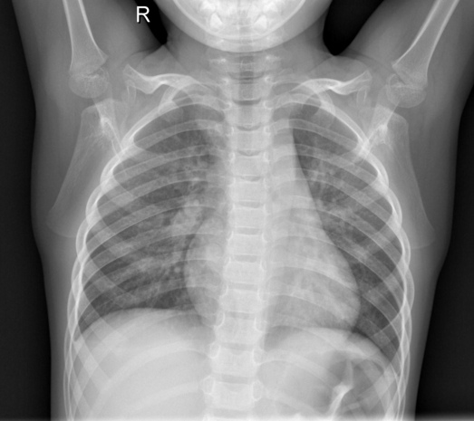

# Predicting Normal or Pneumonia Chest X-rays using Deep Learning
This is my first attempt at a Machine Learning project. My goal is to get familiar with hands-on machine learning
with Pytorch and implementing various ML algorithms.
This project uses Image Classification Models to predict whether a chest x-ray is NORMAL or with PNEUMONIA.

## Table of Contents

- [Installation](#installation)
- [Use](#use)  
- [How to Run](#how-to-run)
- [Data](#dataset)    
- [Models](#models)    
- [Results](#results)    
- [License](#license)
- [Acknowledgements](#acknowledgements)     
- [Footer](#footer)
      
### Installation
Clone project:
```
git clone https://github.com/Nishita-Kapoor/pneumonia_detection_xrays.git
```
Once cloned, install packages:
```
pip install -r requirements.txt
```
Next download data from Kaggle following this [link](https://www.kaggle.com/paultimothymooney/chest-xray-pneumonia).
Note - downloading data from Kaggle requires Kaggle account and API.
### Use
-folder structure, files
### How to Run


### Dataset
-EDA Results
-Data Pre-Processing

Dataset Name: Chest X-Ray Images (Pneumonia)
Dataset Link: [Kaggle Chest Xray(Pneumonia) dataset](https://www.kaggle.com/paultimothymooney/chest-xray-pneumonia)
```
Number of Class         : 2
Number/Size of Images   : Total      : 5856 (1.15 Gigabyte (GB))
                          Training   : 5216 
                          Validation : 16  
                          Testing    : 624  
```
#### Sample Input:


<!-- .element height="10%" width="50%" -->

 ### Models
-VGG-16 and ResNet-50
-Transfer Learning Details
    
### Results
- Hyperparameter tuning experiments
- Metrics (Acc, F1, Confusion matrix)
- Training Curves (plots of train, val) for both models
    
### License
Please see [LICENSE](./LICENSE)
    
### Acknowledgements
I do not claim ownership for this program. This was used as a learning experience; 
this code is from the Kaggle notebook found [here](https://www.kaggle.com/dnik007/pneumonia-detection-using-pytorch/comments)

### Footer
Please feel free to contribute/use the repo as per need. In case of any questions,
you can reach me at <nishita.s66@gmail.com>.