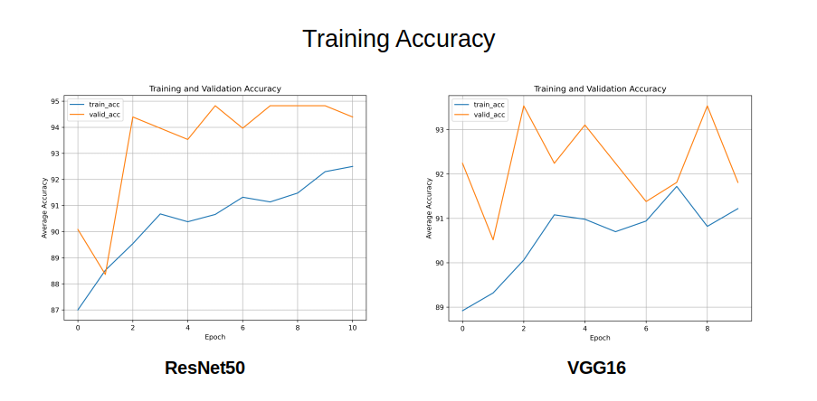
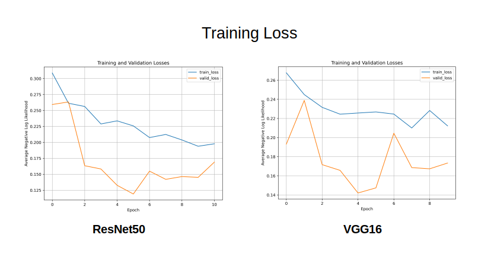
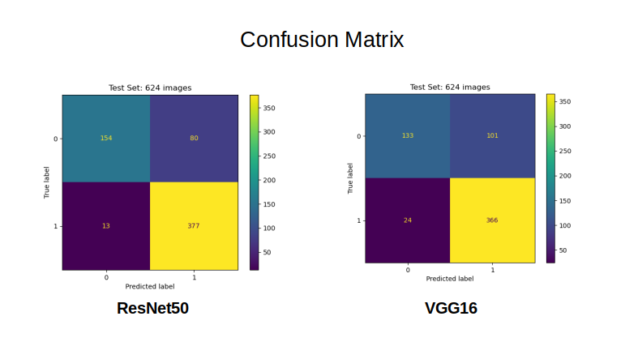

# Predicting Normal or Pneumonia Chest X-rays using Deep Learning
This is my first attempt at a Machine Learning project. My goal was to get familiar with hands-on machine learning
using Pytorch and implementing various ML algorithms.

#### Abstract:
Pneumonia is a life-threatening infectious disease affecting one or both lungs in humans commonly caused by bacteria 
called Streptococcus pneumoniae. Chest X-Rays which are used to diagnose pneumonia, need expert radiotherapists for 
evaluation. Thus, developing an automatic system for detecting pneumonia would be beneficial for treating the disease 
without any delay particularly in remote areas. 

This work, appraises the functionality of pre-trained CNN models followed by different classifiers for
the classification of abnormal and normal chest X-Rays.

## Table of Contents

- [Installation](#installation)  
- [Usage](#usage)  
- [Data](#dataset)    
- [Models](#models)    
- [Results](#results)    
- [License](#license)
- [Acknowledgements](#acknowledgements)     
- [Footer](#footer)
      
### Installation
Clone project:
```
git clone https://github.com/Nishita-Kapoor/pneumonia_detection_xrays.git
```
Once cloned, install packages:
```
pip install -r requirements.txt
```
Next download data from Kaggle following this [link](https://www.kaggle.com/paultimothymooney/chest-xray-pneumonia).
Note - downloading data from Kaggle requires Kaggle account and API.

### Usage
The code in this repo can be run by ```python main.py --config configs/final/<config_name>.yaml``` 
by modifying configurations in the config file.

#### Config file
Config files are in ```.yaml``` format:

```yaml
# Output files/checkpoints will be stored with this run-name folder structure.
# Ensure the run_name starts with model name, e.g. "vgg16-pneumonia-run1" or "resnet50-debug"

run_name: "resnet50-pneumonia-run1"  

datadir: "datasets/chest_xray"    

# Choose from "vgg16" or "resnet50"

model: "resnet50"   
gpus: "0"                      # which GPU to use in case of Multi-gpu

# Each task will be run sequentially one after the other in the given order:
# "EDA": For dataset analysis
# "train" : Training mode
# "evaluate" : To evaluate a testset folder
# "predict" : Single Image predictions

tasks: ["EDA","train"]         # Choose from "EDA", "train", "evaluate", "predict"

# Training Parameters
train:
  batch_size: 8          
  n_epochs: 10           
  optimizer: "Adam"       
  
# Evaluate Parameters
evaluate:
  batch_size: 8                 
  data_split: ['test']          # which dataset to evaluate, choose between 'train', 'val', 'test'

# Single Image Prediction
predict:
  image_path: "/home/nishita/datasets/chest_xray/train/PNEUMONIA/person1_bacteria_2.jpeg"  

```

### Dataset
Dataset Name: Chest X-Ray Images (Pneumonia) 

Download Link: [Kaggle Chest Xray(Pneumonia) dataset](https://www.kaggle.com/paultimothymooney/chest-xray-pneumonia)

The dataset is organized into 3 folders (train, test, val) and contains subfolders for
each image category (Pneumonia/Normal). All images are ```.jpeg``` grayscale with varying input sizes.

The original Kaggle dataset has the following distribution, with only 16 images in val folder.
```
Original Kaggle Dataset:
Number of Class         : 2
Number/Size of Images   : Total      : 5856 (1.15 Gigabyte (GB))
                          Training   : 5216 
                          Validation : 16  
                          Testing    : 624  
```
The existing data distribution has too few validation images (16). 
To improve this further, 216 images (108 Normal and 108 Pneumonia) were transferred from training set 
to validation set. The modified dataset used in this repo has following distribution:

```
Modified Dataset:
Number of Class         : 2
Number/Size of Images   : Total      : 5856 (1.15 Gigabyte (GB))
                          Training   : 5000 
                          Validation : 232 
                          Testing    : 624  
```
#### Sample Input:


#### Training images by category: 


Note: The training set is an imbalanced dataset for Normal & Pneumonia (about 1:3). Hence, 
```WeightedRandomSampler``` was implemented to deal with the imbalanced dataset.

#### Image pre-processing:
To prepare the images for the network, they were resized to 224 x 224 and normalized by 
subtracting a mean value and dividing by a standard deviation. The validation and testing data was not augmented 
but only resized and normalized. The normalization values are standardized for Imagenet.

```
image_transforms = {
    # Train uses data augmentation
    'train':
    transforms.Compose([
        transforms.RandomResizedCrop(size=256, scale=(0.8, 1.0)),
        transforms.RandomRotation(degrees=15),
        transforms.ColorJitter(),
        transforms.RandomHorizontalFlip(),
        transforms.CenterCrop(size=224),  # Image net standards
        transforms.ToTensor(),
        transforms.Normalize([0.485, 0.456, 0.406],
                             [0.229, 0.224, 0.225])  # Imagenet standards
    ]),  
```


 ### Models
The project uses models built using transfer learning with PyTorch. The models supported are [VGG16](https://arxiv.org/pdf/1409.1556.pdf) and 
[ResNet-50](https://arxiv.org/pdf/1512.03385.pdf). 


### Results
As expected, ResNet50 outperformed the VGG-16 on all metrics. 

Training was done only on a single Asus ROG laptop GPU (Nvidia GTX965M).
Training Time was approx 4-5 mins per epoch.

- **Training Curves** 






- **Model performances**:
  
The following was observed on the Test set (624 images) -

|               |  VGG16    | ResNet50  |
| ------------- |:---------:| ---------:|
| **Accuracy**  |    79%    |    85%    |
| **F1 Score**  |    0.76   |    0.83   |
| **Precision** |    0.81   |    0.87   |
| **Recall**    |    0.75   |    0.81   |


- **Confusion Matrix**



From the confusion matrix, it seems that ResNet50 is a better choice due to fewer False Negatives (13) in comparison to VGG-16 (24).    
### License
Please see [LICENSE](./LICENSE)
    
### Acknowledgements
The project is intended purely as a learning experience. The framework was built based on the
original code found in Kaggle [here](https://www.kaggle.com/dnik007/pneumonia-detection-using-pytorch/comments). 

### Footer
Please feel free to contribute/use the repo as per need. In case of any questions,
you can reach me at <nishita.s66@gmail.com>.